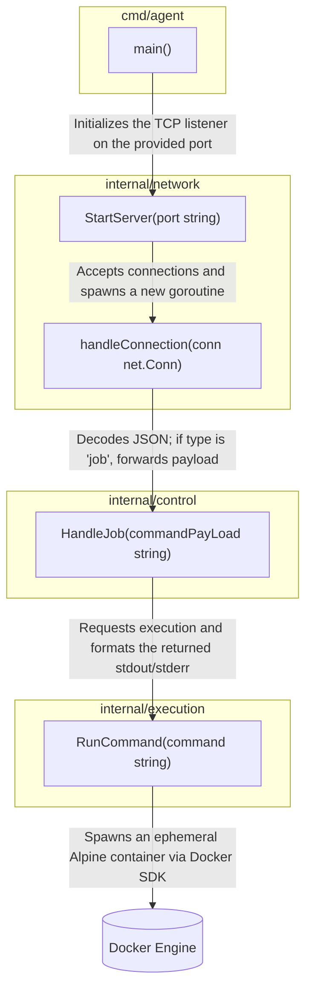

# Node Agent

A distributed Remote Code Execution (RCE) Agent built in Go. This service listens for incoming execution jobs via TCP, processes them, and safely executes code inside isolated Docker containers.

## Architecture

The agent follows a strict layered architecture to ensure separation of concerns:

1.  **Network Layer (`internal/network`)**: Handles TCP connections and protocol parsing.
2.  **Control Layer (`internal/control`)**: Manages business logic and job routing.
3.  **Execution Layer (`internal/execution`)**: Interfaces with the Docker Engine to create ephemeral sandboxes for code execution.

##  Project Structure

```text
node-agent/
├── cmd/
│   └── agent/
│       └── main.go           #  Application Entry Point
│
├── internal/
│   ├── network/              # TCP Server & Protocol Definitions
│   ├── control/              # Job Handling Logic
│   └── execution/            # Docker SDK Integration (Sandboxing)
│
├── playground/               #  Folder for experiments
│
├── go.mod                    # Dependencies

└── README.md                 # Project Documentation
```
